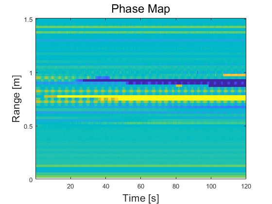
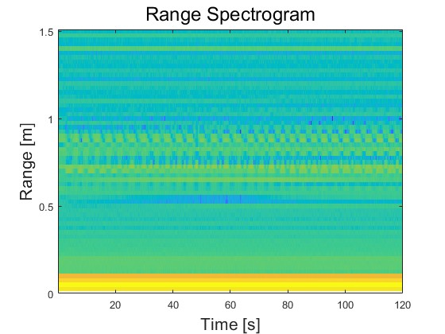
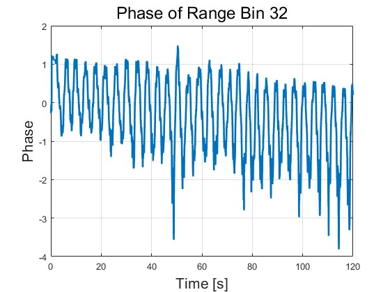
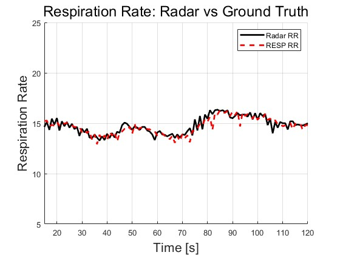
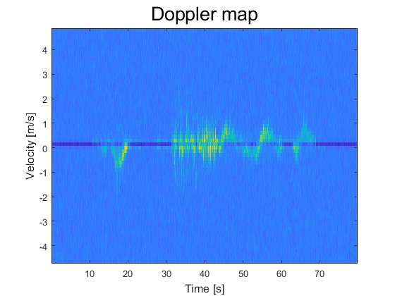
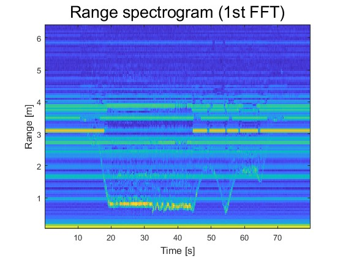
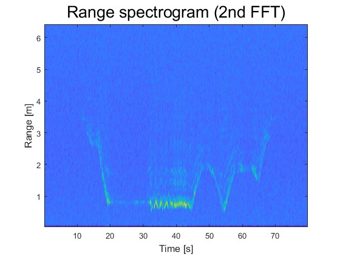
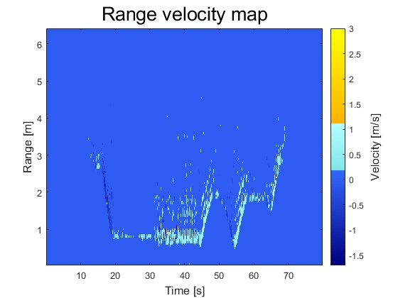
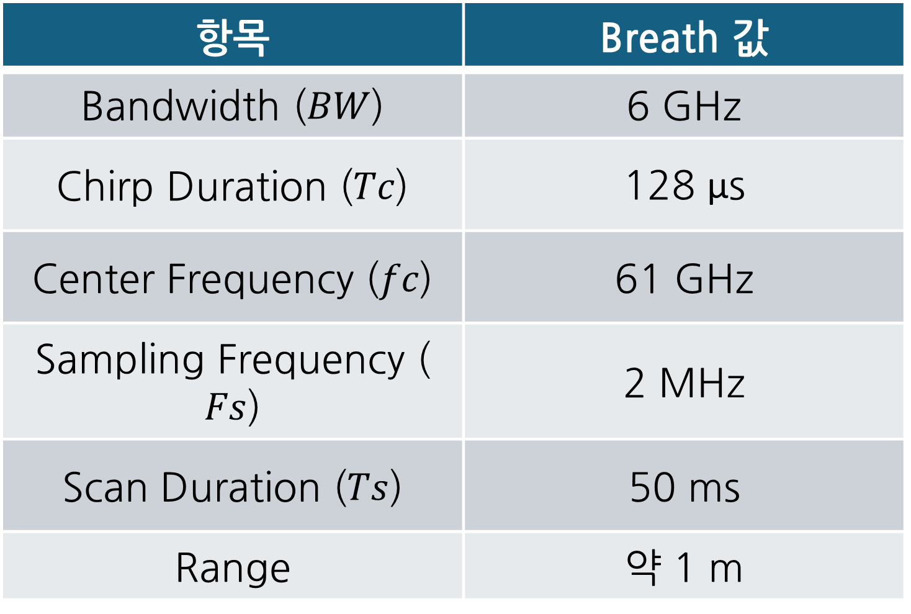
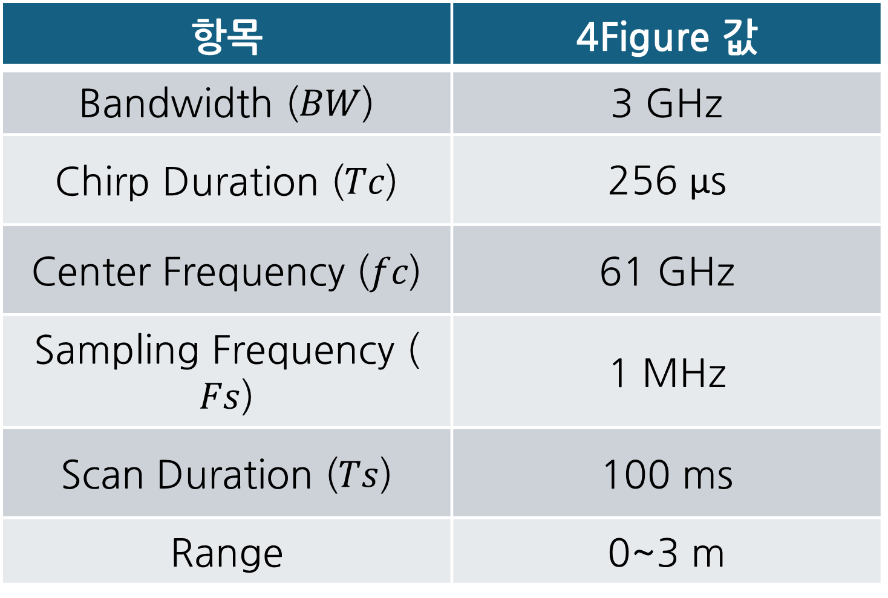

# Vital Sensing: Breathing and Motion Detection

본 프로젝트는 FMCW 레이더를 활용하여 비접촉 방식으로 인체의 미세 변위(호흡) 및 동적 움직임을 측정하고 분석하는 연구입니다. 숭실대학교 NSPL 학부연구생 과정 중 수행되었습니다.

## 1. Breathing Detection (호흡 측정)

FMCW 레이더의 위상(Phase) 변화를 정밀하게 추적하여 흉부의 미세한 움직임을 추출하고, 이를 통해 실시간 호흡률을 산출합니다.

### 주요 알고리즘
* Phase Extraction: 타겟 빈(Bin)에서의 위상 변화 추출 - 1m 지점
* Phase Unwrapping: 위상 불연속성 제거를 통한 연속 변위 데이터 확보
* Bandpass Filtering: 호흡 주파수 대역(0.1Hz ~ 0.5Hz) 신호 정제

### 결과 (Experimental Results)
* **상관계수(Correlation)**: 0.84
* **평균 오차(MSE)**: 0.2183

<table style="width: 100%; border-collapse: collapse;">
  <tr>
    <td style="width: 50%; border: none; text-align: center; padding: 10px;">
      
        
      <strong style="font-size: 1.15em;">전체 페이즈 맵</strong>
    </td>
    <td style="width: 50%; border: none; text-align: center; padding: 10px;">
      
        
      <strong style="font-size: 1.15em;">레인지 스펙트로그램</strong>
    </td>
  </tr>
  <tr>
    <td style="width: 50%; border: none; text-align: center; padding: 10px;">
      
        
      <strong style="font-size: 1.15em;">타겟 위치(32번 Bin) 페이즈</strong>
    </td>
    <td style="width: 50%; border: none; text-align: center; padding: 10px;">
      
        
      <strong style="font-size: 1.15em;">최종 산출 호흡률(BPM)</strong>
    </td>
  </tr>
</table>

---

## 2. Motion Detection (움직임 측정)

타겟의 거리와 속도 변화를 실시간으로 탐지하여 움직임의 패턴과 강도를 분석합니다.

### 주요 알고리즘
* 2D FFT: 거리(Range) 및 속도(Doppler) 정보 동시 추출

### 분석 데이터 및 시각화
* Range-Doppler Map: 타겟의 거리와 속도 분포 시각화
* Range-Spectrogram (1st/2nd FFT): 신호 처리 단계별 주파수 분석 결과
* Range-Velocity Map: 시간에 따른 타겟의 속도 변화 추적

<table style="width: 100%; border-collapse: collapse;">
  <tr>
    <td style="width: 50%; border: none; text-align: center; padding: 10px;">
      
        
      <strong style="font-size: 1.15em;">도플러 맵</strong>
    </td>
    <td style="width: 50%; border: none; text-align: center; padding: 10px;">
      
        
      <strong style="font-size: 1.15em;">1차 FFT 결과</strong>
    </td>
  </tr>
  <tr>
    <td style="width: 50%; border: none; text-align: center; padding: 10px;">
      
        
      <strong style="font-size: 1.15em;">2차 FFT 결과</strong>
    </td>
    <td style="width: 50%; border: none; text-align: center; padding: 10px;">
      
        
      <strong style="font-size: 1.15em;">레인지-벨로시티 맵</strong>
    </td>
  </tr>
</table>

---

## 레이더 실험 환경 및 파라미터 설정

<table style="width: 100%; border-collapse: collapse;">
  <tr>
    <td style="width: 50%; border: none; text-align: center; vertical-align: middle; padding: 10px;">
      
        
      <strong style="font-size: 1.1em;">호흡 파라미터</strong>
    </td>
    <td style="width: 50%; border: none; text-align: center; vertical-align: middle; padding: 10px;">
      
        
      <strong style="font-size: 1.1em;">움직임 파라미터</strong>
    </td>
  </tr>
</table>