# Vital Sensing: Breathing and Motion Detection

본 프로젝트는 FMCW 레이더를 활용하여 비접촉 방식으로 인체의 미세 변위인 호흡과 동적인 움직임을 정밀하게 측정하고 분석하는 연구입니다. 숭실대학교 NSPL 학부연구생 과정 중 수행되었으며, 레이더 신호 처리를 통한 생체 신호 추출의 전 과정을 포함하고 있습니다.

## 1. Breathing Detection (미세 호흡 측정)

FMCW 레이더의 위상(Phase) 변화를 정밀하게 추적하여 흉부에서 발생하는 미세한 움직임을 추출하고, 이를 호흡률로 산출하는 알고리즘을 구현했습니다.

### 주요 알고리즘 및 구현 상세
* **Phase Extraction**: 타겟이 위치한 약 1m 지점(32번 Range Bin)의 복소수 데이터에서  신체 변위가 반영된 위상 정보를 추출했습니다.
* **Phase Unwrapping**: 위상 데이터의 불연속성을 제거하는 언래핑 공정을 거쳐 시간에 따른 연속적인 흉부 변위 데이터를 확보했습니다.
* **Signal Refinement**: 추출된 신호에서 호흡과 무관한 잡음을 배제하기 위해 0.1Hz에서 0.5Hz 사이의 주파수만 통과시키는 Butterworth Bandpass Filter를 설계하여 호흡 주기 신호를 정밀하게 정제했습니다.

### 연구 결과 및 검증 (Experimental Results)
* 접촉식 호흡 센서를 통한 Ground Truth 데이터와 레이더 산출 데이터를 비교 분석했습니다.
* 분석 결과, 상관계수(**Correlation**) **0.84**와 절대 평균 오차(**MAPE**) **0.2183**를 달성하며 비접촉 방식임에도 높은 정확도로 호흡률을 측정할 수 있음을 검증했습니다.

### [Radar Signal Processing Pipeline]
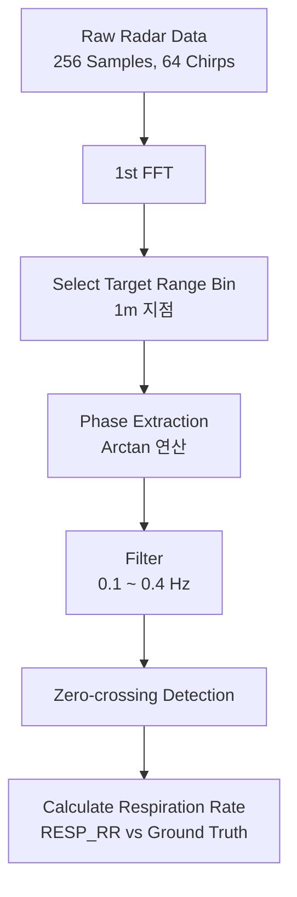
```mermaid
graph TD
    A[Raw Radar Data <br/> 256 Samples, 64 Chirps] --> B[1st FFT]
    B --> C[Select Target Range Bin <br/> 1m 지점]
    C --> D[Phase Extraction <br/> Arctan 연산]
    D --> E[Filter <br/> 0.1 ~ 0.4 Hz]
    E --> F[Zero-crossing Detection]
    F --> G[Calculate Respiration Rate <br/> RESP_RR vs Ground Truth]
```

<table style="width: 100%;">
  <tr>
    <td align="center" style="width: 50%; border: none; padding: 10px;">
      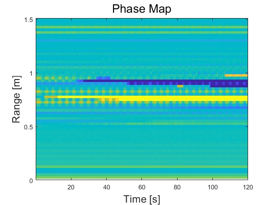
        
      <strong style="font-size: 1.15em;">전체 페이즈 맵</strong>
    </td>
    <td align="center" style="width: 50%; border: none; padding: 10px;">
      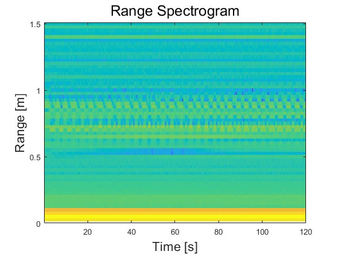
        
      <strong style="font-size: 1.15em;">레인지 스펙트로그램</strong>
    </td>
  </tr>
  <tr>
    <td align="center" style="width: 50%; border: none; padding: 10px;">
      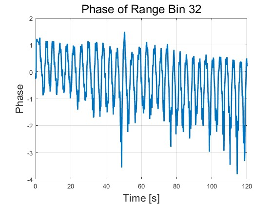
        
      <strong style="font-size: 1.15em;">타겟 위치(32번 Bin) 페이즈</strong>
    </td>
    <td align="center" style="width: 50%; border: none; padding: 10px;">
      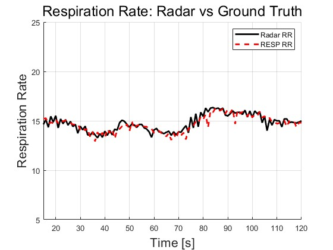
        
      <strong style="font-size: 1.15em;">최종 산출 호흡률(BPM)</strong>
    </td>
  </tr>
</table>

---

## 2. Motion Detection (움직임 측정)

타겟의 거리와 속도 변화를 실시간으로 탐지하여 인체의 움직임 패턴과 강도를 분석할 수 있는 모니터링 시스템을 구축했습니다.

### 신호 처리 파이프라인
* **2D FFT Analysis**: Fast-time FFT와 Slow-time FFT를 결합한 2차 FFT 처리를 통해 타겟의 거리(Range)와 도플러 속도(Doppler) 정보를 동시에 추출했습니다.
* **Time-Frequency Visualization**: 신호 처리 단계별 주파수 특성을 확인하기 위해 1차 및 2차 FFT 결과를 스펙트로그램으로 시각화하여 움직임의 연속성을 분석했습니다.
### [Radar Signal Processing Pipeline]
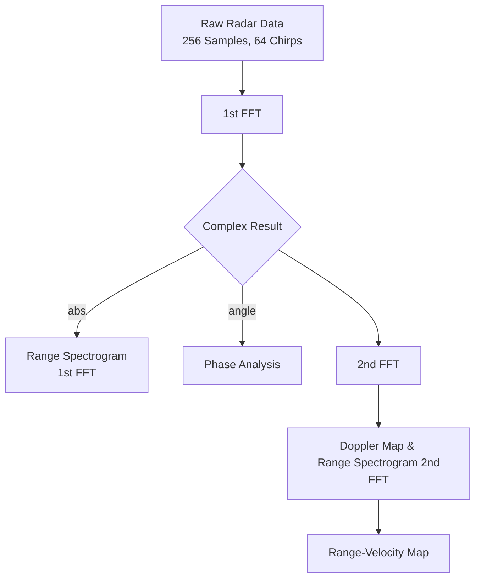
```mermaid
graph TD
    A[Raw Radar Data <br/> 256 Samples, 64 Chirps] --> B[1st FFT <br/>]
    B --> C{Complex Result}
    
    %% 시각화/분석 분기
    C -->|abs| D[Range Spectrogram <br/> 1st FFT]
    C -->|angle| E[Phase Analysis]
    
    %% 연산 흐름 (복소수 데이터 유지)
    C --> F[2nd FFT <br/>]
    
    F --> G[Doppler Map & <br/> Range Spectrogram 2nd FFT]
    G --> H[Range-Velocity Map]
```

<table style="width: 100%;">
  <tr>
    <td align="center" style="width: 50%; border: none; padding: 10px;">
      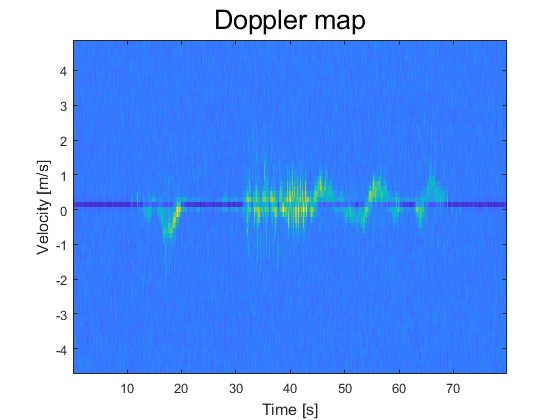
        
      <strong style="font-size: 1.15em;">도플러 맵</strong>
    </td>
    <td align="center" style="width: 50%; border: none; padding: 10px;">
      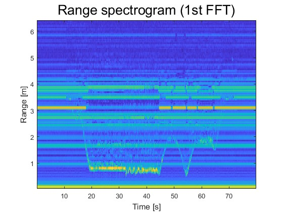
        
      <strong style="font-size: 1.15em;">1차 FFT 결과</strong>
    </td>
  </tr>
  <tr>
    <td align="center" style="width: 50%; border: none; padding: 10px;">
      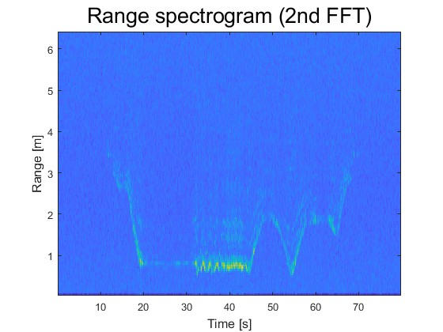
        
      <strong style="font-size: 1.15em;">2차 FFT 결과</strong>
    </td>
    <td align="center" style="width: 50%; border: none; padding: 10px;">
      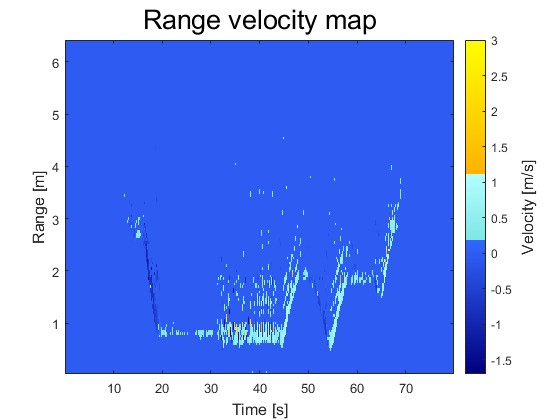
        
      <strong style="font-size: 1.15em;">레인지-벨로시티 맵</strong>
    </td>
  </tr>
</table>

---

## 레이더 실험 환경 및 파라미터 설정

<table style="width: 100%;">
  <tr>
    <td align="center" style="width: 50%; border: none; vertical-align: middle; padding: 10px;">
      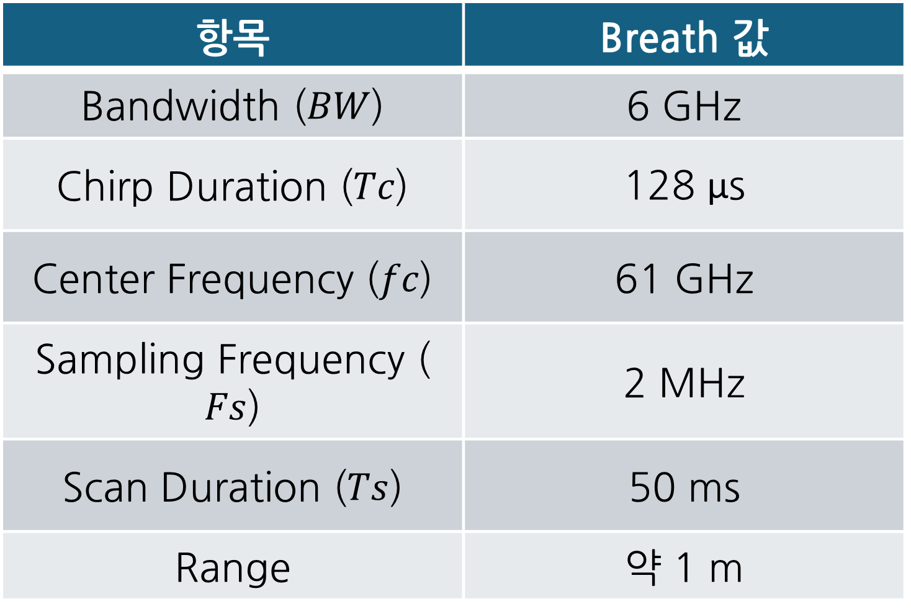
        
      <strong style="font-size: 1.1em;">호흡 파라미터</strong>
    </td>
    <td align="center" style="width: 50%; border: none; text-align: center; vertical-align: middle; padding: 10px;">
      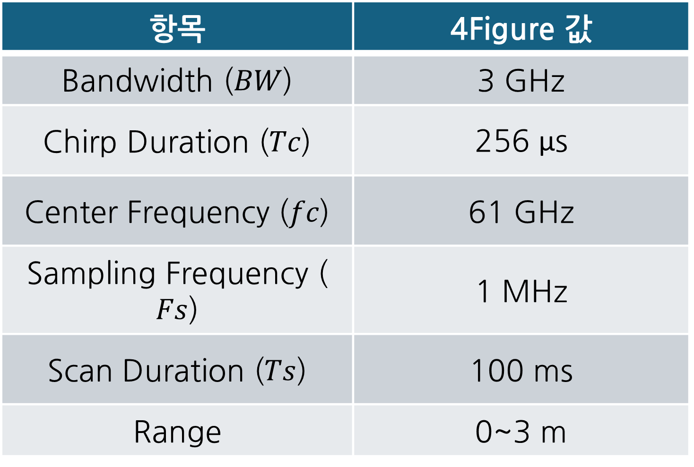
        
      <strong style="font-size: 1.1em;">움직임 파라미터</strong>
    </td>
  </tr>
</table>
