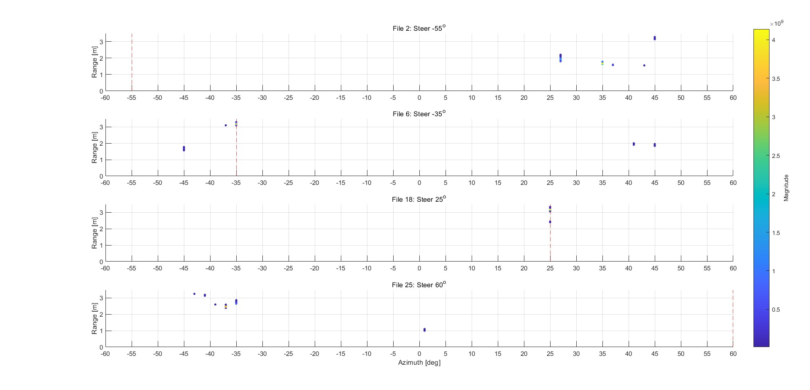
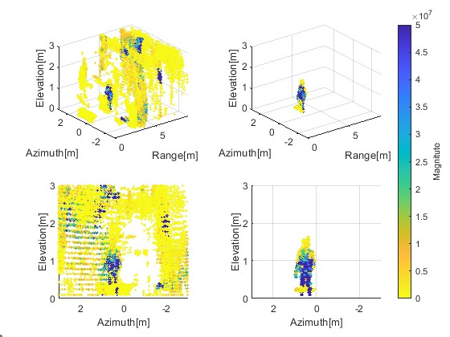
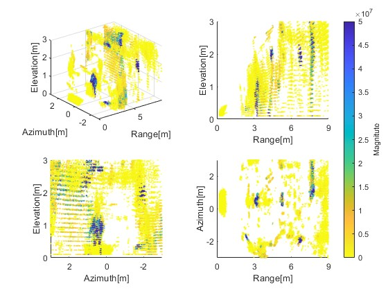
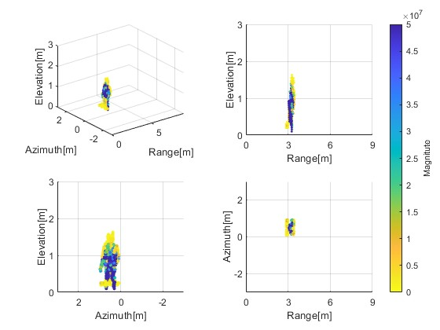
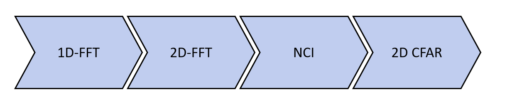
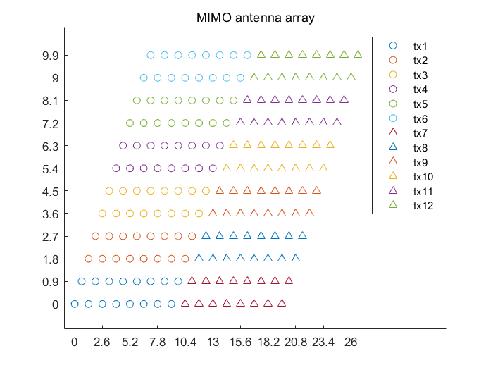
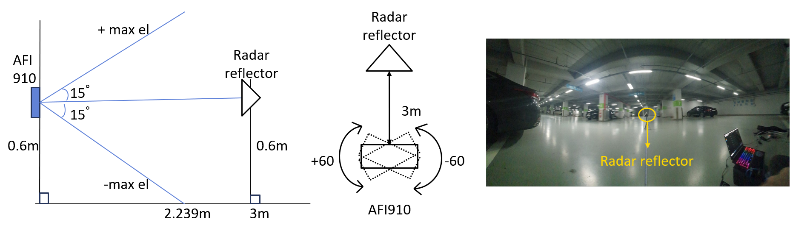
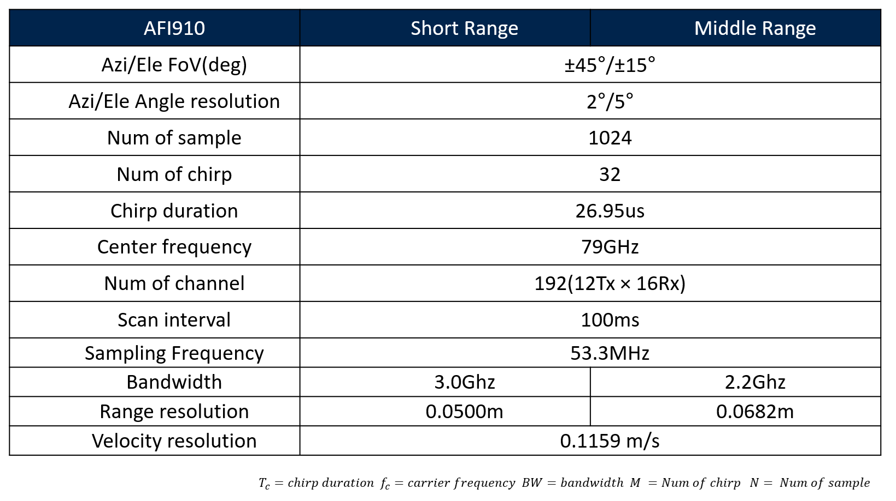

# Target Detection and SAR Imaging: Beamforming and Human SAR

본 프로젝트는 MIMO 레이더 시스템을 활용하여 신규 레이더의 방위각(Azimuth)을 검증하고, SAR(Synthetic Aperture Radar) 알고리즘을 적용하여 고해상도 인체 형상 이미징을 수행한 연구 기록입니다.

## 1. Beamforming + FOV (신규 레이더 빔포밍 코드 작성 및 FOV 검증)

신규 레이더 도입 이후 데이터 처리 및 빔포밍 코드 작성 후 이를 이용한 FOV 검증 과정입니다.

### 주요 알고리즘
* MIMO Radar Processing: 가상 안테나(Virtual Array) 기술을 적용하여 안테나 개수 대비 높은 각도 해상도를 확보했습니다.

* Non-Coherent Integration: SNR 개선을 위해 반복 신호의 크기나 전력만 합산하는 방식으로 기존에 쓰던 레이더와같이 RAW 데이터가 아닌 후처리 되는 데이터 구조에 대한 학습을 진행했습니다.

* Constant false alarm rate: Threshold를 고정시키지 않고  유동적으로 변화 시켜 peak를 검출하고 이 peak의 range, doppler index를 계산하는 레이더 내부처리 과정에 대한 학습을 진행했습니다.

### 결과 (Experimental Results)
* **Azimuth FOV**: Azimuth($\pm 45^\circ$)
* **신규 레이더 데이터 처리 코드 및 빔포밍 코드 작성 성공**
* **표준 파이프라인 구축**: 신규 레이더 운용을 위한 신호 처리 표준 파이프라인을 구축하여 연구실 자산화에 기여했습니다.
- 해당 레이더로 Azimuth($\pm 60^\circ$) 구간을 5도씩 변경하여 평균 25스캔을 측정한 결과를 포인트 클라우드로 변경후 PDF로 시각화 하여 FOV를 파악하고, Azimuth($\pm 45^\circ$)을 벗어나는 경우 잘못된 각도에 포인트가 생김으로 신뢰 구간을 넘기지 않고 사용해야 함을 확인할 수 있었습니다.

<table style="width: 100%; border-collapse: collapse;">
  <tr>
    <td align="center" style="width: 50%; border: none; vertical-align: middle; padding: 10px;">
      
        
      <strong style="font-size: 1.15em;">아지무스 검증 결과 1</strong>
    </td>
    <td align="center" style="width: 50%; border: none; vertical-align: middle; padding: 10px;">
      
        
      <strong style="font-size: 1.15em;">아지무스 검증 결과 2</strong>
    </td>
  </tr>
</table>

---

## 2. Human_Taget_SAR(인간 타겟 SAR 시스템 구현)

신규 레이더 검증 실험 이후 데이터 해상도 향상을 위한 방안으로 아두이노와 리니어 스테이지 기반 SAR(Synthetic Aperture Radar)시스템을 설계하는 과정입니다.

#### 주요 알고리즘 및 구현 (Implementation)

* **Ground Segmentation (SMRF)**: 연구실 선행 연구 알고리즘을 상속받아 실제 실험 데이터에 적용하고, 환경에 최적화된 임계값(Threshold)을 튜닝하여 지면 노이즈를 효과적으로 제거했습니다.

* **DBSCAN Clustering**: K-Distance Graph 분석을 통해 데이터 특성에 맞는 최적의 $\epsilon=0.2$를 도출하여 노이즈와 인간 타겟을 성공적으로 분리했습니다.

#### 연구 기여도 및 배운 점
 
* **통계 기반 타겟 식별**: 클러스터별 점의 개수와 신호 강도(Magnitude) 통계 분석을 통해 타겟 식별의 신뢰도를 확보했습니다.
* **연구 고도화 및 협업 전문성**: 선배 연구진의 고난도 실험에 데이터 처리 모듈 제작 및 보조 역할로 참여하며, 데이터셋 처리 기법과 실무적인 노이즈 억제 전략을 학습하여 분석 역량을 한 단계 고도화하였습니다.

* **후속 연구 진행**:RAW 데이터를 제공하는 레이더로 PointCloud가 아닌 SAR 프로젝트로 이어졌습니다.

<table style="width: 100%; border-collapse: collapse;">
  <tr>
    <td align="center" style="width: 33.33%; border: none; vertical-align: middle; padding: 10px;">
      
        
      <strong style="font-size: 1.15em;">DBSCAN 적용 전/후 비교</strong>
    </td>
    <td align="center" style="width: 33.33%; border: none; vertical-align: middle; padding: 10px;">
      
        
      <strong style="font-size: 1.15em;">DBSCAN 적용 후 Point Cloud</strong>
    </td>
    <td align="center" style="width: 33.33%; border: none; vertical-align: middle; padding: 10px;">
      
        
      <strong style="font-size: 1.15em;">DBSCAN 적용 후 Point Cloud</strong>
    </td>
  </tr>
</table>

## 3. Radar Parameters (레이더 파라미터)

본 실험들에 적용된 세부 시스템 파라미터 설정값입니다.

  
    
  <strong style="font-size: 1.2em;">레이더 내부 데이터 처리 프로세스</strong>

  
    
  <strong style="font-size: 1.2em;">레이더 MIMO 레이더 세팅</strong>

<table style="width: 100%;">
    <td align="center" style="width: 50%; border: none; padding: 10px;">
      
        
      <strong style="font-size: 1.2em;">FOV 검증 실험 환경</strong>
    </td>
    <td align="center" style="width: 50%; border: none; padding: 10px;">
      
        
      <strong style="font-size: 1.2em;">인간 타겟 SAR 실험 환경</strong>
    </td>
</tr>

<tr>
    <td align="center" style="width: 50%; border: none; padding: 10px;">
      
        
      <strong style="font-size: 1.2em;">SAR 구동을 위한 회로도</strong>
    </td>
    <td align="center" style="width: 50%; border: none; padding: 10px;">
      
        
      <strong style="font-size: 1.2em;">리니어 스테이지 (790mm)</strong>
    </td>
</tr>

</table>

<tr>
    <td align="center" style="width: 100%; border: none; padding: 10px;">
      
        
      <strong style="font-size: 1.2em;">레이더 파라미터(실험 공통)</strong>
    </td>
  </tr>
<tr>
