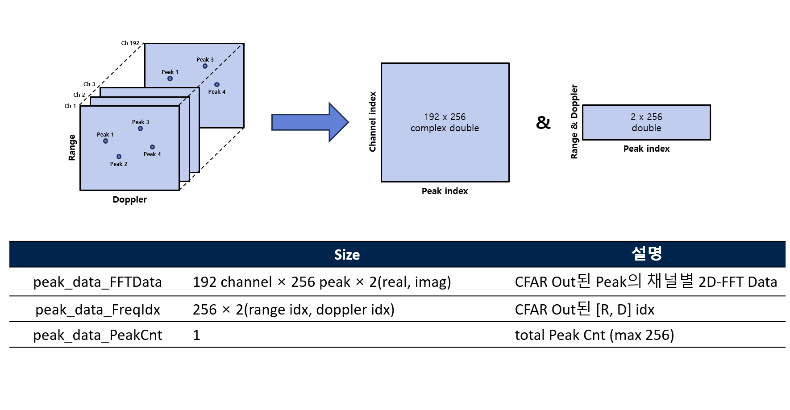
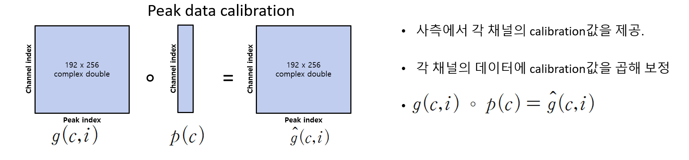
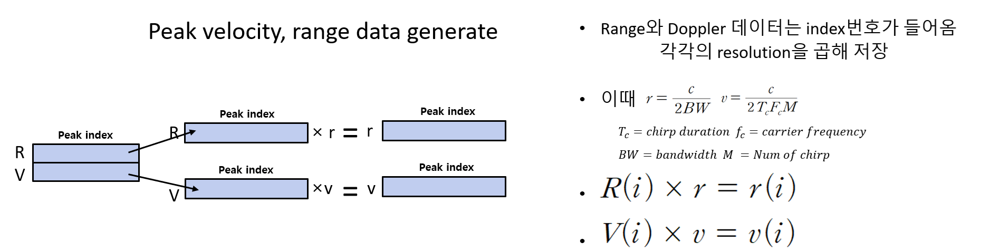

# Target Detection and SAR Imaging: Beamforming and Human SAR

본 프로젝트는 MIMO 레이더 시스템을 활용하여 신규 레이더의 방위각(Azimuth)을 검증하고, SAR(Synthetic Aperture Radar) 알고리즘을 적용하여 고해상도 인체 형상 이미징을 수행한 연구 기록입니다.

## 1. Beamforming + FOV (신규 레이더 빔포밍 코드 작성 및 FOV 검증)

신규 레이더 도입 이후 데이터 처리 및 빔포밍 코드 작성 후 이를 이용한 FOV 과정입니다.

### 주요 알고리즘
* MIMO Radar Processing: 가상 안테나(Virtual Array) 기술을 적용하여 안테나 개수 대비 높은 각도 해상도를 확보했습니다.

### 결과 (Experimental Results)
* **Azimuth FOV**: +- 45도
* **신규 레이더 데이터 처리 코드 및 빔포밍 코드 작성 성공**

<table style="width: 100%;">
  <tr>
    <td align="center" style="width: 70%; border: none; padding: 10px;">
      
        
      <strong style="font-size: 1.2em;">아지무스 검증 결과 1</strong>
    </td>
    <td align="center" style="width: 30%; border: none; padding: 10px;">
      
        
      <strong style="font-size: 1.2em;">아지무스 검증 결과 2</strong>
    </td>
  </tr>
</table>

---

## 3. Radar Parameters (레이더 파라미터)

본 실험에 적용된 세부 시스템 파라미터 설정값입니다.

  
    
  <strong style="font-size: 1.2em;">레이더 내부 데이터 처리 프로세스</strong>

  
    
  <strong style="font-size: 1.2em;">레이더 MIMO 레이더 세팅</strong>

<table style="width: 100%;">
  <tr>
    <td align="center" style="width: 50%; border: none; padding: 10px;">
      
        
      <strong style="font-size: 1.2em;">데이터 처리 프로세스 1</strong>
    </td>
    <td align="center" style="width: 50%; border: none; padding: 10px;">
      
        
      <strong style="font-size: 1.2em;">데이터 처리 프로세스 2</strong>
    </td>
  </tr>
  <tr>
    <td align="center" style="width: 50%; border: none; padding: 10px;">
      
        
      <strong style="font-size: 1.2em;">데이터 처리 프로세스 3</strong>
    </td>
    <td align="center" style="width: 50%; border: none; padding: 10px;">
      
        
      <strong style="font-size: 1.2em;">레이더 파라미터(실험 공통)</strong>
    </td>
  </tr>
<tr>
    <td align="center" style="width: 50%; border: none; padding: 10px;">
      
        
      <strong style="font-size: 1.2em;">FOV 검증 실험 환경</strong>
    </td>
    <td align="center" style="width: 50%; border: none; padding: 10px;">
      
        
      <strong style="font-size: 1.2em;">인간 타겟 SAR 실험 환경</strong>
    </td>
  </tr>

</table>