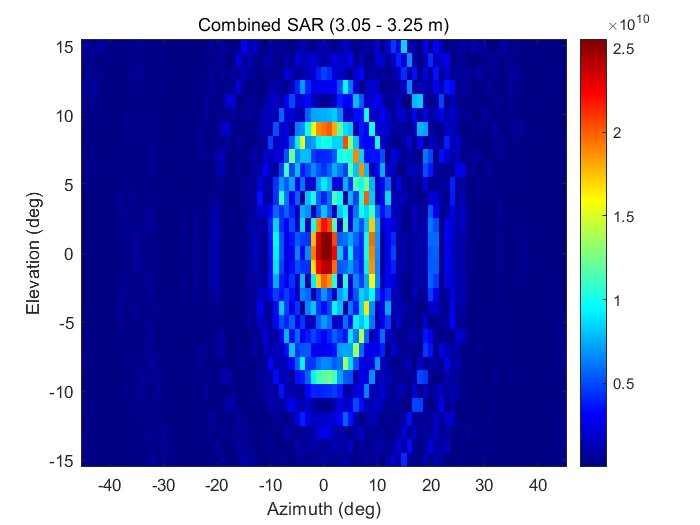
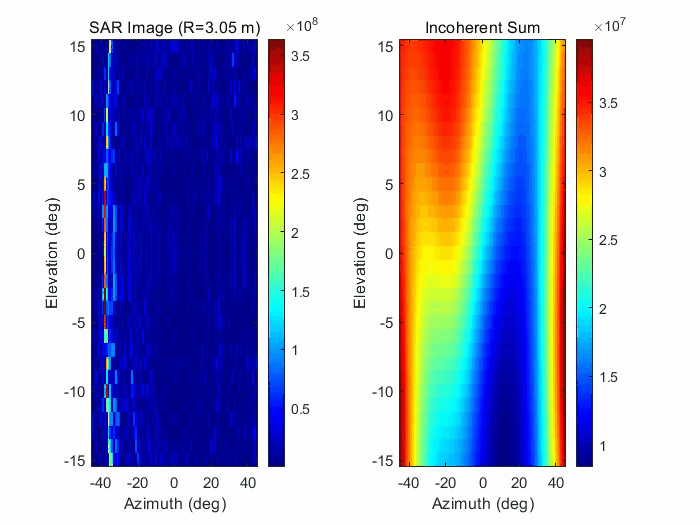
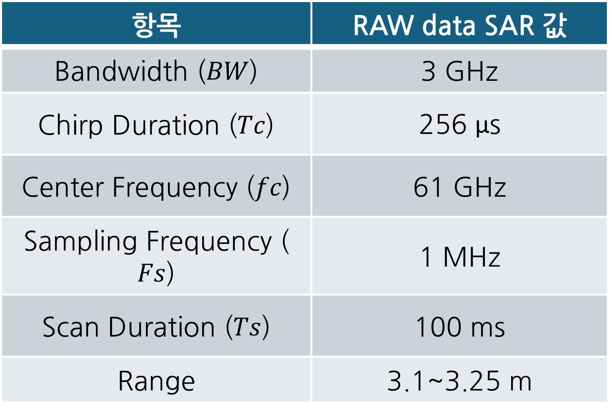

# 03. Industrial SAR Imaging & Phase Calibration

본 프로젝트는 과 의 프로젝트들을 통해 배운 지식을 모두 통합하여 다시 RAW 데이터 제공하는 61GHz MIMO 레이더를 활용하여 철판 타겟에 대한 고해상도 SAR(Synthetic Aperture Radar) 이미징을 수행하고, 정밀 위상 보정(Phase Calibration)을 통해 이미지 선명도를 극대화한 연구 기록입니다.

## 1. 주요 알고리즘 및 구현 (Key Implementation)

* Multi-Dimensional FFT Pipeline
    * 1st FFT (Range): Hamming Window를 적용하여 256개 샘플로부터 정밀한 거리 정보 추출
    * 2nd FFT (Doppler): 64개의 Chirp 데이터를 처리하여 타겟의 속도 성분 도출 및 Range-Doppler Map 생성
* MIMO Beamforming & Phase Calibration
    * 8개 채널의 복소 위상 불균형을 해결하기 위해 고정 위상 보정값(`gPhaseCal_complex`)을 적용하여 빔포밍 정밀도 향상
    * Steering Vector 연산을 통해 Azimuth($\pm 45^\circ$)와 Elevation($\pm 15^\circ$)에 대한 3차원 공간 데이터 복원
    * 01 프로젝트들의 1채널 raw 데이터 처리 + 02 프로젝트들의 SAR를 고도화 시킨 경험을 바탕으로 RAW 데이터로 SAR를 구현
* Slant Range Correction SAR
    * 레이더의 실제 물리적 위치와 측정 거리 사이의 오차($\Delta R$)를 실시간 보정하는 위상 보정(`phase_corr`) 알고리즘 구현
    * Coherent vs Incoherent Sum: 위상 동기 누적(Coherent) 방식을 적용하여 타겟의 초점(Focusing) 성능을 에너지 누적 방식 대비 대폭 개선

## 연구 기여도 및 배운 점

* 독자적 시스템 구축 및 확장: 직접 구현한 데이터 전처리 및 SAR 시스템 기반 포인트 클라우드 코드를 연구실 표준으로 구축했습니다.

* 하드웨어 인터페이스 이해: 리니어 스테이지의 이동 속도와 레이더 스캔 주기를 물리적으로 동기화하는 과정을 통해 하드웨어와 소프트웨어 간의 유기적인 결합 중요성과 RAW 데이터 제공/비 제공 레이더 간의 하드웨어 특성을 파악하여 분석 가능한 능력을 향상시켰습니다.

* 데이터 자산화: 위상 보정 및 이미지 복원 프로세스를 모듈화하여 후속 연구자들이 재사용 가능한 가이드라인 형태로 정리했습니다.

## 2. 실험 결과 (Experimental Results)

<table style="width: 100%;">
  <tr>
    <td align="center" style="width: 50%; border: none; padding: 10px;">
      
        
      <strong style="font-size: 1.1em;">위상 보정 후 누적 SAR 데이터</strong>
    </td>
    <td align="center" style="width: 50%; border: none; padding: 10px;">
      
        
      <strong style="font-size: 1.1em;">고해상도 SAR 형상 복원 과정 시각화</strong>
    </td>
  </tr>
</table>

## 3. Radar Parameters (레이더 파라미터)

본 실험들에 적용된 세부 시스템 파라미터 설정값입니다.

<tr>
    <td align="center" style="width: 50%; border: none; padding: 10px;">
      
        
      <strong style="font-size: 1.2em;">SAR 구동을 위한 회로도</strong>
    </td>
    <td align="center" style="width: 50%; border: none; padding: 10px;">
      
        
      <strong style="font-size: 1.2em;">리니어 스테이지 (790mm)</strong>
    </td>
</tr>

<table>
<td align="center" style="width: 50%; border: none; text-align: center; vertical-align: middle; padding: 10px;">
      
        
      <strong style="font-size: 1.1em;">움직임 파라미터</strong>
    </td>
  </tr>
</table>