# 레이더 시스템 및 신호처리 기초 이론 (Radar System Fundamentals)

본 문서는 학부 연구생 과정 중 논문 서베이와 레이더 관련 프로젝트 진행 전 FMCW 레이더를 중심으로 레이더 시스템의 기본 작동 원리, 신호 모델링, 그리고 고해상도 각도 추정 알고리즘에 대한 이론적 배경을 정리한 공간입니다.

---

## 1. 레이더 기본 원리 및 파형 분류

레이더는 전자기파를 송신하여 물체에 반사되어 돌아오는 신호를 수신함으로써 표적의 거리, 속도, 각도 정보를 획득하는 시스템입니다.

### 연속파 (Continuous Wave, CW) 레이더
* 변조되지 않은 단일 주파수 파형을 사용하여 표적의 속도 정보만을 취득합니다.
* 송신 신호 모델: $s_t(t) = A \cos(2\pi f_c t)$

### 펄스 도플러 (Pulse-Doppler) 레이더
* 송신 시점부터 반사파 수신 시점까지의 시간 지연($t_d$)을 측정하여 거리를 계산합니다.
* 거리 추정 공식: $R = \frac{c \cdot t_d}{2}$

### FMCW (Frequency Modulated Continuous Wave) 레이더
* 주파수가 시간에 따라 선형적으로 변화하는 첩(Chirp) 신호를 사용하여 거리와 속도를 동시에 측정합니다.
* 위상 함수 모델: $\phi(t) = 2\pi f_c t + \pi \frac{B}{T_c} t^2$

<table style="width: 100%; border-collapse: collapse;">
  <tr>
    <td align="center" style="width: 33.33%; border: none; vertical-align: middle; padding: 10px;">
      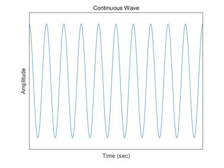
        
      <strong style="font-size: 1.15em;">연속파 (Continuous Wave, CW)</strong>
    </td>
    <td align="center" style="width: 33.33%; border: none; vertical-align: middle; padding: 10px;">
      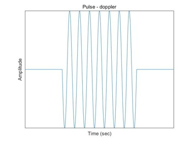
        
      <strong style="font-size: 1.15em;">펄스 도플러 (Pulse-Doppler)</strong>
    </td>
    <td align="center" style="width: 33.33%; border: none; vertical-align: middle; padding: 10px;">
      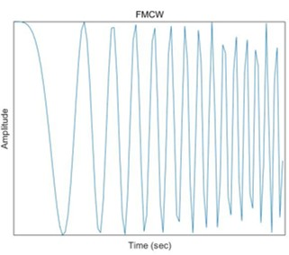
        
      <strong style="font-size: 1.15em;">FMCW (Frequency Modulated Continuous Wave)</strong>
    </td>
  </tr>
</table>
---

## 2. 레이더 방정식과 RCS (Radar Cross Section)

### 레이더 방정식 (Radar Equation)
* 수신기에 도달하는 전력($P_r$)은 표적 거리($R$)의 4제곱에 반비례하며, 시스템 이득과 표적의 반사 특성에 의해 결정됩니다.
* $P_r = \frac{P_t G_t G_r \sigma \lambda^2}{(4\pi)^3 R^4 L}$

### RCS (표적 단면적)
* 표적이 전자기파를 얼마나 효과적으로 레이더 방향으로 반사하는지를 나타내는 지표입니다.
* $\sigma = \lim_{R \to \infty} 4\pi R^2 \frac{|E_s|^2}{|E_i|^2}$

<table style="width: 100%; border-collapse: collapse;">
  <tr>
    <td align="center" style="width: 50%; border: none; vertical-align: middle; padding: 10px;">
      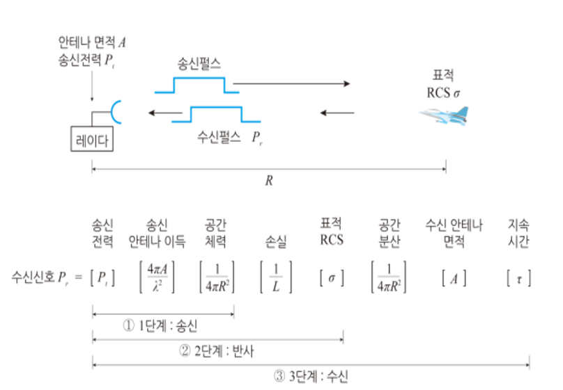
        
      <strong style="font-size: 1.15em;">레이더 방정식</strong>
    </td>
    <td align="center" style="width: 50%; border: none; vertical-align: middle; padding: 10px;">
      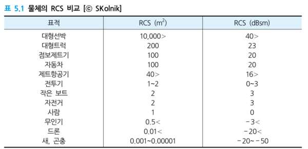
        
      <strong style="font-size: 1.15em;">사람 RCS를 1로 기준으로 잡았을 때 물체의 평균 RCS
      </strong>
    </td>
  </tr>
</table>

---

## 3. 레이더 신호처리 기초 (Signal Processing)

### 비트 주파수 (Beat Frequency) 추출
* 송신 신호와 수신 신호를 믹싱한 후 저역 통과 필터(LPF)를 거쳐 두 신호의 주파수 차이인 비트 주파수를 획득합니다.
* 추출된 주파수($\hat{f}$)는 거리와 속도 성분을 모두 포함합니다.
* $\hat{f} = \frac{B}{T_c} \frac{2R}{c} - f_c \frac{2v}{c}$

### I/Q 샘플링 및 복소 신호 처리
* 신호의 진폭과 위상 정보를 보존하기 위해 In-phase 성분과 Quadrature 성분으로 나누어 샘플링합니다.
* 복소수 표현: $x(t) = x_I(t) + j x_Q(t) = A e^{j\phi(t)}$

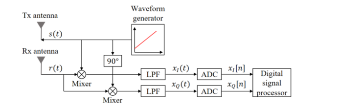

---

## 4. 타겟 각도 추정 (Angle Estimation)

### 고해상도 각도 추정 알고리즘 비교
* 여러 타겟이 인접해 있을 때 분해능을 극대화하기 위한 알고리즘들입니다.

| 알고리즘 | 특징 | 계산 부하 (초) | 분해능 정확도 |
| :--- | :--- | :---: | :---: |
| Bartlett | 연산량이 적으나 분해능이 낮음 | 0.023 | 낮음 |
| Capon (MVDR) | 잡음을 최소화하며 타겟 신호 유지 | 0.047 | 중간 |
| MUSIC | 고유값 분해를 통한 초고해상도 구현 | 0.026 | 매우 높음 |

* 수치 분석 결과, MUSIC 알고리즘이 가장 날카로운 주엽(Main-lobe) 특성을 보여 각도 분해능이 가장 우수함을 확인했습니다.

<table style="width: 100%; border-collapse: collapse;">
  <tr>
    <td align="center" style="width: 50%; border: none; vertical-align: middle; padding: 10px;">
      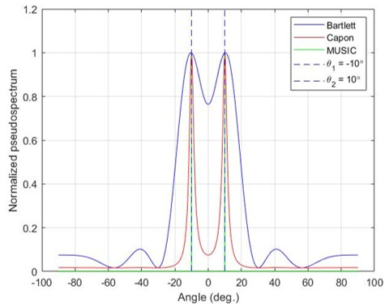
        
      <strong style="font-size: 1.15em;"></strong>
    </td>
    <td align="center" style="width: 50%; border: none; vertical-align: middle; padding: 10px;">
      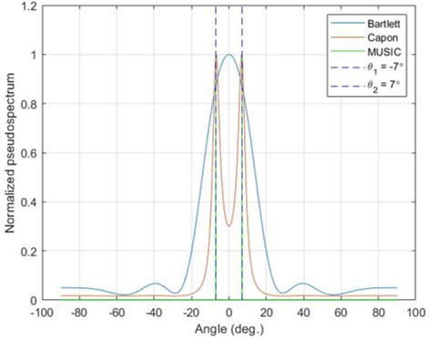
        
      <strong style="font-size: 1.15em;">
      </strong>
    </td>
  </tr>
</table>
---

## 5. 레이더 신호처리 

<table style="width: 100%; border-collapse: collapse;">
  <tr>
    <td align="center" style="width: 33.33%; border: none; vertical-align: middle; padding: 10px;">
      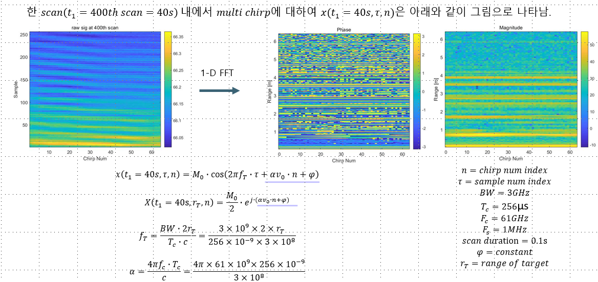
        
      <strong style="font-size: 1.15em;"></strong>
    </td>
    <td align="center" style="width: 33.33%; border: none; vertical-align: middle; padding: 10px;">
      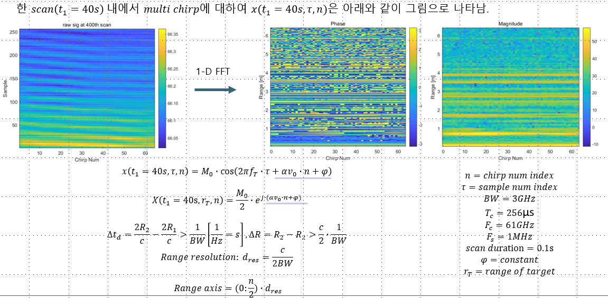
        
      <strong style="font-size: 1.15em;">
      </strong>
    </td>
    <td align="center" style="width: 33.33%; border: none; vertical-align: middle; padding: 10px;">
      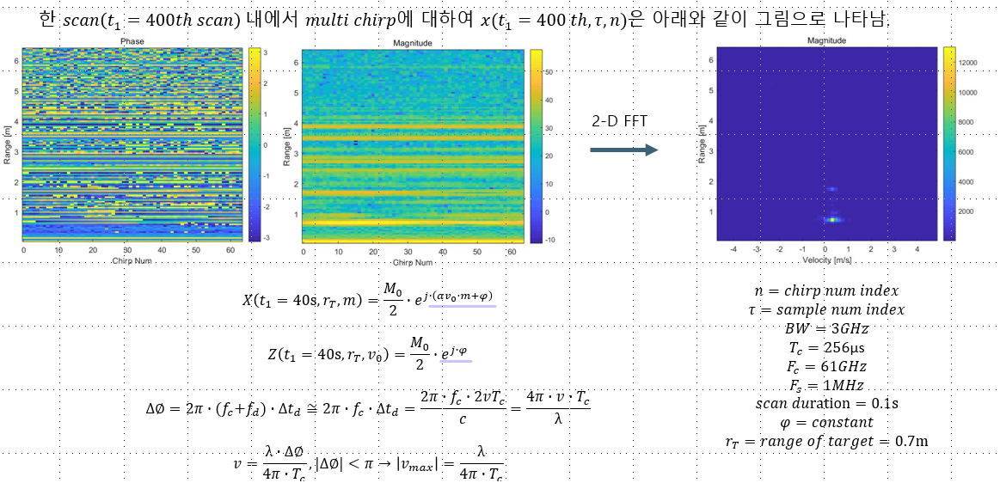
        
      <strong style="font-size: 1.15em;">
      </strong>
    </td>
  </tr>
</table>

---
## 📚 Reference
* 한국항공대학교 - 항공전자정보공학부 - 이성욱 교수 레이더 시스템 공학
* 숭실대학교 신호처리 연구실 교육 자료
* TI사 The fundamentals of millimeter wave radar sensors
* 곽영길, ⌜레이더 시스템 공학⌟, 청문각(2017)
📄 **[Detailed Radar Theory & Signal Processing (PDF)](./docs/img/Theory_Background_FMCW_Radar.pdf)**
>본 페이지의 기반이 된 레이더 시스템 이론 및 수식 모델링 정리 자료입니다.