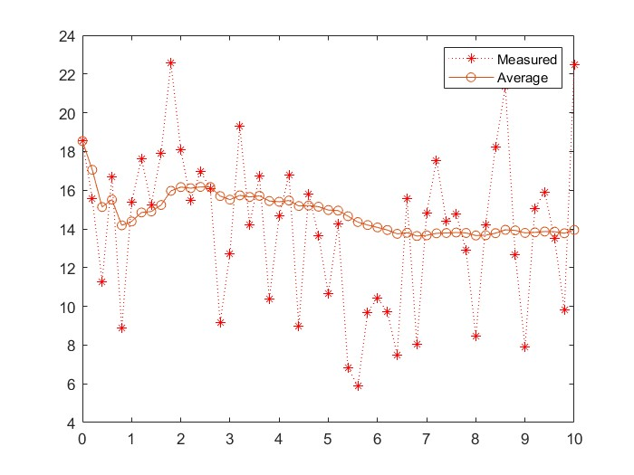
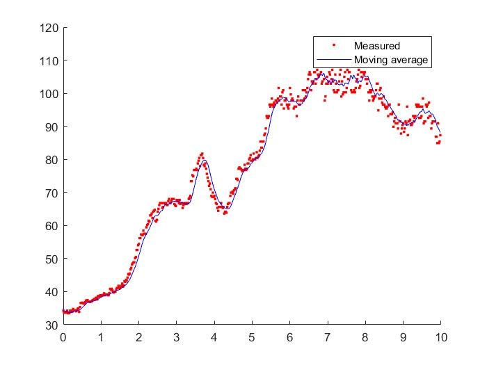
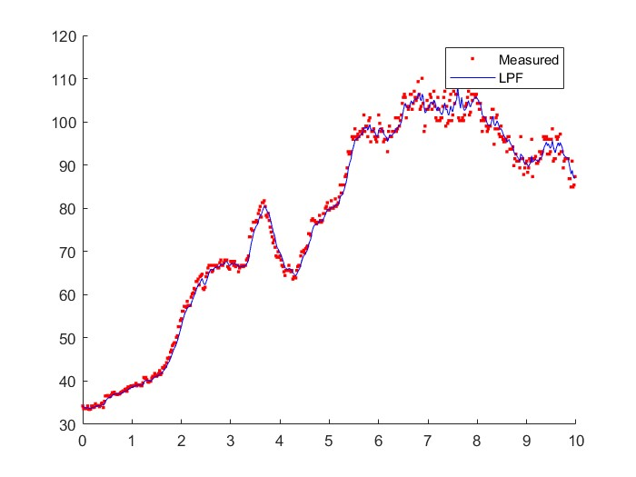
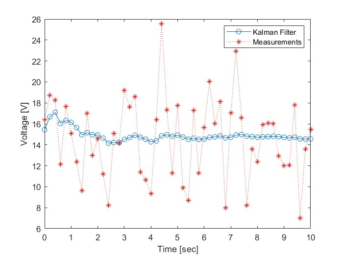
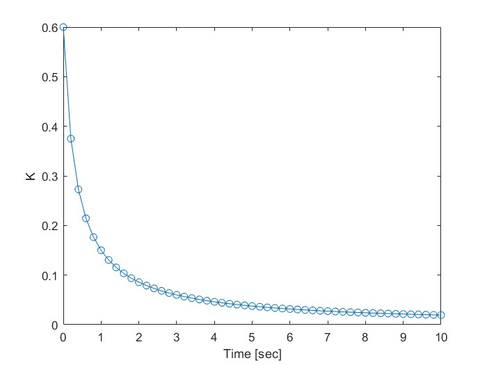
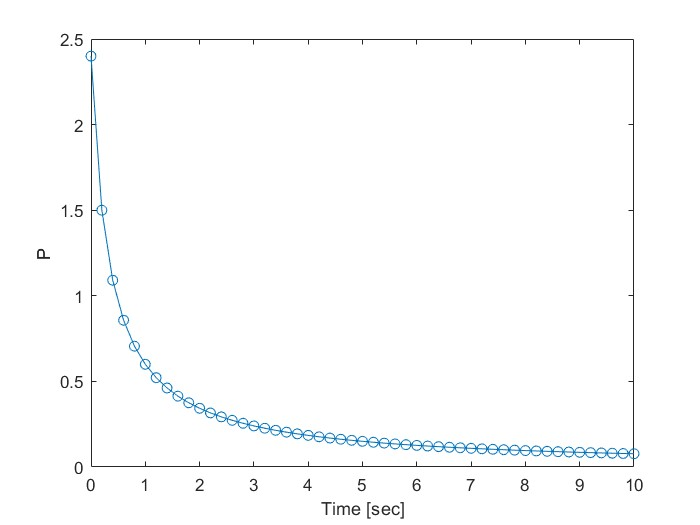
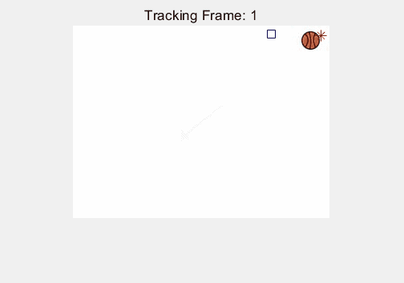
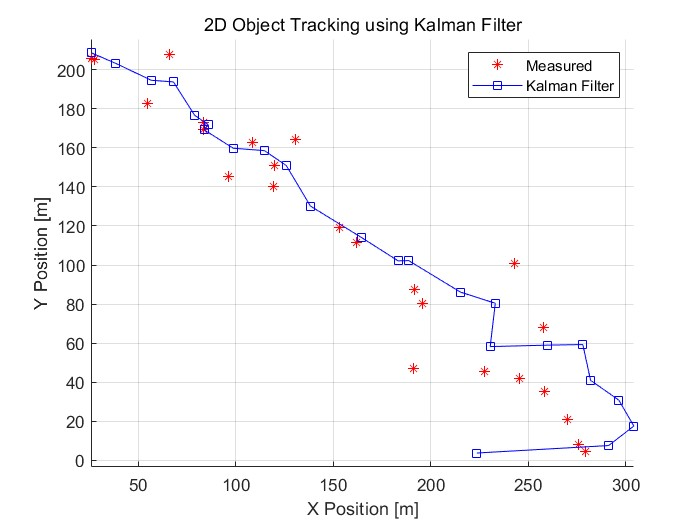

# Study

본 파일은 학부 연구생을 진행하며 공부한 사항 중 일부를 기록용으로 남겨놓았으며, 레이더 신호 처리 과정을 위해
그라운드 트루쓰로 사용된 모션 센서 csv 데이터를 다룬 것과 칼만 필터에 대한 학습 및 예제 코드의 결과를 모와놨습니다.

# 📈 Kalman Filter 학습을 위한 기초 필터 3종 정리

---

## 1. 필터 비교 요약
모든 필터는 데이터를 쌓아두고 계산하는 배치식(Batch)이 아닌, 이전 결과값에 새 데이터를 더하는 재귀식(Recursive)으로 구현되었습니다. 이는 메모리 사용량을 최소화해야 하는 실시간 시스템(레이더, 자율주행 등)에 필수적인 구조입니다.

| 구분 | 평균 필터 (Avg Filter) | 이동 평균 필터 (MovAvg Filter) | 저주파 통과 필터 (LPF) |
| :---: | :--- | :--- | :--- |
| 핵심 원리 | 전체 데이터의 누적 평균 | 최근 $N$개 데이터의 평균 | 과거 추정값과 현재 측정값의 가중합 |
| 가중치($\alpha$) | $1/k$ (데이터가 쌓일수록 감소) | $1/N$ (고정된 창 크기) | 상수 (예: 0.7, 고정 비중) |
| 장점 | 잡음 제거 효과가 매우 강력함 | 데이터의 변화 추세(Trend) 반영 | 구현이 쉽고 실시간 응답성이 좋음 |
| 단점 | 데이터가 많아지면 변화에 무뎌짐 | 버퍼($N$)만큼의 메모리 추가 필요 | 위상 지연(Phase Delay) 발생 |

---
### ① 평균 필터 (Simple Average Filter)
- 수식: $\bar{x}_{k} = \frac{k-1}{k} \cdot \bar{x}_{k-1} + \frac{1}{k} \cdot x_{k}$
- >> 시간이 지날수록 새로운 측정값($x_{k}$)을 거의 반영하지 않으며 시스템이 '정적'일 때 가장 정확한 값을 찾아낼 수 있음.

> 

### ② 이동 평균 필터 (Moving Average Filter)
- 수식: $\bar{x}_{k} = \bar{x}_{k-1} + \frac{1}{n} \cdot (x_{k} - x_{k-n})$
- >> 슬라이딩 윈도우 방식을 재귀적으로 구현하여 계산 효율을 향상 ($O(1)$).

> 

### ③ 1차 저주파 통과 필터 (1st Order LPF)
- 수식: $\hat{x}_{k} = \alpha \cdot \hat{x}_{k-1} + (1 - \alpha) \cdot z_{k}$
- >> 최근 데이터에 가중치를 주는 지수 가중 이동 평균 방식. $\alpha$값 설정을 통해 노이즈 제거와 반응성 사이의 Trade-off를 조절하는 것이 핵심.

> 

-----

## 🚀 칼만 필터(Kalman Filter)로의 연결

해당 기초 필터들을 통해 얻은 결론은 "과거의 예측값과 현재의 측정값 사이에서 어떻게 균형을 잡을 것인가?"가 핵심!

칼만 필터는 여기서 한 걸음 더 나아가:
1. 고정된 $\alpha$가 아니라, 매 순간 최적의 가중치(Kalman Gain)를 스스로 계산.
2. 시스템의 물리적 모델(예: 등속도 운동)을 결합하여 단순 평균보다 훨씬 정밀한 추정을 수행.

---
# 1차원 칼만 필터: 전압 추정 (SimpleKalman2)

본격적인 칼만 필터의 기본 구조인 예측과 보정의 재귀적 루프를 1차원 스칼라 모델을 통해 학습 과정.

## 알고리즘 설계

칼만 필터는 시스템의 물리적 모델과 측정 장비의 오차를 기반으로 매 순간 최적의 가중치인 칼만 이득(이전까지의 $\alpha$의 역할)을 계산.
해당 과정은 예측과 업데이트를 지속적으로 반복함

### Step 1: 예측 (Prediction)
현재 상태를 기반으로 다음 단계의 전압을 추측 단계.
* 상태 변수 예측: xp = A * x
* 오차 공분산 예측: Pp = A * P * A' + Q

### Step 2: 추정 및 보정 (Update)
새로운 측정값을 받아 예측값을 수정하여 최적의 추정치를 계산 단계.
* 칼만 이득 계산: K = Pp * H' * inv(H * Pp * H' + R)
* 상태 업데이트: x = xp + K * (z - H * xp)
* 공분산 업데이트: P = Pp - K * H * Pp

## 주요 파라미터 설정 및 의미 (해당 예제 코드에서의 의미)

| Parameter | Symbol | Code Value | Meaning |
|------------|--------|------------|------------|
| System Noise | Q | 0 | 시스템(전압)이 시간에 따라 변하지 않는다고 가정 (프로세스 노이즈 없음) |
| Measurement Noise | R | 4 | 센서 측정 노이즈의 분산이 4 (표준편차 = 2V) |
| Initial State Estimate | x₀ | 14 | 초기 전압을 14V로 추정하고 시작 |
| Initial Error Covariance | P₀ | 6 | 초기 추정값의 불확실성 (분산 6) |
| Kalman Gain | K | Time-varying | 예측값과 측정값 사이의 최적 가중치 |

## 실험 결과 분석

<table style="width: 100%; border-collapse: collapse;">
  <tr>
    <td align="center" style="width: 33.33%; border: none; vertical-align: middle; padding: 10px;">
      
        
      <strong style="font-size: 1.15em;">칼만 필터 예제</strong>
    </td>
    <td align="center" style="width: 33.33%; border: none; vertical-align: middle; padding: 10px;">
      
        
      <strong style="font-size: 1.15em;">K (Kalman Gain)</strong>
    </td>
    <td align="center" style="width: 33.33%; border: none; vertical-align: middle; padding: 10px;">
      
        
      <strong style="font-size: 1.15em;">P (Error Covariance)</strong>
    </td>
  </tr>
</table>

해당 결과는 1차원 전압 추정이었으며, 시스템 자체의 변화(Q)는 없으나 측정 과정의 노이즈(R)만 고려된 결과
Q=0이면:
→ 결국 K → 0 : 필터가 측정값을 거의 무시하게 됨

# 2차원 물체 추적: 등속도 모델 (TrackKalman)

1차원 시스템을 확장하여 평면상의 위치(x, y)와 직접 측정하지 않는 속도(vx, vy)를 동시에 추정하는 과정.

## 알고리즘 설계

상태 변수를 위치와 속도로 구성하여 행렬 연산을 통해 물체의 궤적을 예측하고 보정함.
상태 벡터 구성: x = [pos_x, vel_x, pos_y, vel_y]'

### Step 1: 예측 (Prediction)
물리 법칙(등속도 운동)을 기반으로 다음 위치와 속도를 추측 단계.
* 상태 변수 예측: xp = A * x (현재 위치 + 속도 * dt)
* 오차 공분산 예측: Pp = A * P * A' + Q

### Step 2: 추정 및 보정 (Update)
측정된 위치(xm, ym)를 바탕으로 예측된 위치와 속도를 수정 단계.
* 칼만 이득 계산: K = Pp * H' * inv(H * Pp * H' + R)
* 상태 업데이트: x = xp + K * (z - H * xp)
* 공분산 업데이트: P = Pp - K * H * Pp

## 주요 파라미터 설정 및 의미 (해당 예제 코드에서의 의미)

| Parameter | Symbol | Code Value | Meaning |
| :--- | :---: | :--- | :--- |
| System Matrix | A | [1 dt 0 0; 0 1 0 0; 0 0 1 dt; 0 0 0 1] | 현재의 위치와 속도를 이용해 다음 상태를 예측 (등속도 모델) |
| Output Matrix | H | [1 0 0 0; 0 0 1 0] | 4개의 상태 변수 중 측정 가능한 위치(x, y)만 골라내는 행렬 |
| System Noise | Q | 1.0 * eye(4) | 가속도 변화 등 시스템 모델이 실제와 다를 가능성에 대한 대비 오차 |
| Measurement Noise | R | [50 0; 0 50] | 센서가 측정한 위치값의 오차 분산 (50으로 설정하여 노이즈 허용) |
| Initial State Estimate | x₀ | [0 0 0 0]' | 공의 초기 위치와 속도를 모두 0으로 가정하고 시작 |
| Initial Error Covariance | P₀ | 100 * eye(4) | 초기 위치 및 속도 추정치가 매우 불확실함을 의미 (분산 100) |
| Kalman Gain | K | Time-varying | 위치 측정값과 물리 모델 예측값 사이의 실시간 최적 가중치 |

## 실험 결과 분석

<table style="width: 100%; border-collapse: collapse;">
  <tr>
    <td align="center" style="width: 50%; border: none; vertical-align: middle; padding: 10px;">
      
        
      <strong style="font-size: 1.15em;">2D 추적 결과 </strong>
    </td>
    <td align="center" style="width: 50%; border: none; vertical-align: middle; padding: 10px;">
      
        
      <strong style="font-size: 1.15em;">추정된 궤적 분석</strong>
    </td>
  </tr>
</table>

## 결과 시각화 분석

### 심볼 정의
* 원본 이미지: GetBallPos를 통해 가져온 실제 추적 대상(공).
* r* (빨간색 별): 센서에 의해 측정된 노이즈가 포함된 위치 (Measured).
* bs (파란색 사각형): 칼만 필터가 물리 모델과 측정값을 융합하여 추정한 최적 위치 (Estimated).

이 밖에도 본 예제에서는 선형 시스템(Linear System)과 가우시안 노이즈(Gaussian Noise)를 가정했으나, 실제 환경에서는 비선형 운동 추적을 위한 EKF(확장 칼만 필터)나 UKF, 그리고 비가우시안 노이즈 상황에서 강력한 PF(파티클 필터) 등으로 확장될 수 있음을 확인.

---

예제 코드 및 학습은 다음과 같은 자료를 참고했으며 예제 코드를 바꾸고 다양한 시각화 방법을 통해 해당 과정에 대해 학습

칼만 필터는 어렵지 않아 with MATLAB Examples 저)김성필
Understanding Kalman Filters - MATLAB Youtube