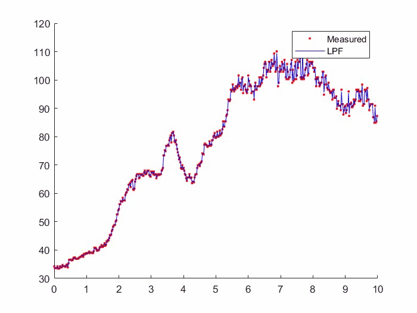

# Study

본 파일은 학부 연구생을 진행하며 공부한 사항 중 일부를 기록용으로 남겨놓았으며, 레이더 신호 처리 과정을 위해
그라운드 트루쓰로 사용된 모션 센서 csv 데이터를 다룬 것과 칼만 필터에 대한 학습 및 예제 코드의 결과를 모와놨습니다.

# 📈 Kalman Filter 학습을 위한 기초 필터 3종 정리

칼만 필터(Kalman Filter)의 동작 원리를 깊이 있게 이해하기 위해 학습 기록입니다.

---

## 1. 필터 비교 요약
필터는 데이터를 쌓아두고 계산하는 배치식(기존의 평균식)이 아닌, 이전 결과값에 새 데이터를 더하는 재귀식으로 구현되었습니다. 이는 메모리 사용량을 최소화해야 하는 실시간 시스템(레이더, 자율주행 등)에 필수적인 구조입니다.

| 구분 | 평균 필터 (Avg Filter) | 이동 평균 필터 (MovAvg Filter) | 저주파 통과 필터 (LPF) |
| :---: | :--- | :--- | :--- |
| 핵심 원리 | 전체 데이터의 누적 평균 | 최근 $N$개 데이터의 평균 | 과거 추정값과 현재 측정값의 가중합 |
| 가중치($\alpha$) | $1/k$ (데이터가 쌓일수록 감소) | $1/N$ (고정된 창 크기) | 상수 (예: 0.7, 고정 비중) |
| 장점 | 잡음 제거 효과가 매우 강력함 | 데이터의 변화 추세(Trend) 반영 | 구현이 쉽고 실시간 응답성이 좋음 |
| 단점 | 데이터가 많아지면 변화에 무뎌짐 | 버퍼($N$)만큼의 메모리 추가 필요 | 위상 지연(Phase Delay) 발생 |

---

## 2. 필터별 상세 분석

### ① 평균 필터 (Simple Average Filter)
- 수식: $avg_k = \frac{k-1}{k} \cdot avg_{k-1} + \frac{1}{k} \cdot x_k$
- >> 시간이 지날수록 새로운 측정값($x_k$)을 거의 반영하지 않게 됩니다. 시스템이 '정적'일 때 가장 정확한 값을 찾아냅니다.

> 

### ② 이동 평균 필터 (Moving Average Filter)
- 수식: $avg_{new} = avg_{old} + \frac{x_{new} - x_{oldest}}{N}$
- 인사이트: 슬라이딩 윈도우 방식을 재귀적으로 구현하여 계산 효율을 극대화했습니다 ($O(1)$). 최근 흐름을 파악하는 데 유리합니다.

> 

### ③ 1차 저주파 통과 필터 (1st Order LPF)
- 수식: $x_{lpf} = \alpha \cdot \hat{x}_{prev} + (1 - \alpha) \cdot x_{meas}$
- >> 최근 데이터에 가중치를 주는 지수 가중 이동 평균 방식입니다. $\alpha$값 설정을 통해 노이즈 제거와 반응성 사이의 Trade-off를 조절하는 것이 핵심입니다.

> 

plus) 

---

## 🚀 칼만 필터(Kalman Filter)로의 연결

해당 기초 필터들을 통해 얻은 결론은 "과거의 예측값과 현재의 측정값 사이에서 어떻게 균형을 잡을 것인가?"가 필터링의 핵심이라는 점입니다.

칼만 필터는 여기서 한 걸음 더 나아가:
1. 고정된 $\alpha$가 아니라, 매 순간 최적의 가중치(Kalman Gain)를 스스로 계산합니다.
2. 시스템의 물리적 모델(예: 등속도 운동)을 결합하여 단순 평균보다 훨씬 정밀한 추정을 수행합니다.

---

예제 코드 및 학습은 칼만 필터는 어렵지 않아 with MATLAB Examples 저)김성필